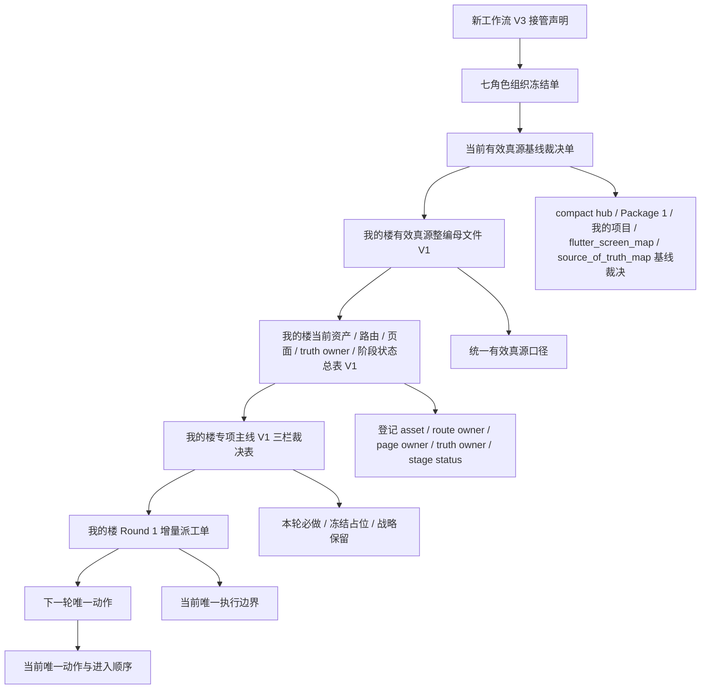

# 《我的楼文书收口正式版 V1》

## 1. 收口范围

- 本次收口只完成：
  - 母文件正式版
  - 总表正式版
  - 阅读顺序
  - 真源挂图
  - 引用链修订清单
- 本次收口明确不做：
  - 新 scope
  - 新 package
  - implementation unlock
  - 三栏裁决改写
  - Round 1 派工边界改写
  - 把 docs-frozen 写成 runtime fully open

## 2. 正式版文书包

- 当前正式版母文件：
  - [my_building_effective_truth_mother_file_v1.md](/Users/wangweiwei/Desktop/展览装修之家总控/docs/00_ssot/my_building_effective_truth_mother_file_v1.md)
- 当前正式版总表：
  - [my_building_asset_route_page_truth_owner_stage_status_table_v1.md](/Users/wangweiwei/Desktop/展览装修之家总控/docs/00_ssot/my_building_asset_route_page_truth_owner_stage_status_table_v1.md)
- 当前被明确保护、不在本次收口中改写的文书：
  - [my_building_mainline_v1_three_column_ruling.md](/Users/wangweiwei/Desktop/展览装修之家总控/docs/00_ssot/my_building_mainline_v1_three_column_ruling.md)
  - [my_building_round1_increment_dispatch.md](/Users/wangweiwei/Desktop/展览装修之家总控/docs/00_ssot/my_building_round1_increment_dispatch.md)
  - [my_building_next_unique_action.md](/Users/wangweiwei/Desktop/展览装修之家总控/docs/00_ssot/my_building_next_unique_action.md)

## 3. 阅读顺序

1. 先读 [new_workflow_v3_takeover_declaration.md](/Users/wangweiwei/Desktop/展览装修之家总控/docs/00_ssot/new_workflow_v3_takeover_declaration.md)。
2. 再读 [seven_role_organization_freeze_v3.md](/Users/wangweiwei/Desktop/展览装修之家总控/docs/00_ssot/seven_role_organization_freeze_v3.md)。
3. 再读 [my_building_effective_truth_baseline_ruling_v1.md](/Users/wangweiwei/Desktop/展览装修之家总控/docs/00_ssot/my_building_effective_truth_baseline_ruling_v1.md)。
4. 再读 [my_building_effective_truth_mother_file_v1.md](/Users/wangweiwei/Desktop/展览装修之家总控/docs/00_ssot/my_building_effective_truth_mother_file_v1.md)。
5. 再读 [my_building_asset_route_page_truth_owner_stage_status_table_v1.md](/Users/wangweiwei/Desktop/展览装修之家总控/docs/00_ssot/my_building_asset_route_page_truth_owner_stage_status_table_v1.md)。
6. 再读 [my_building_mainline_v1_three_column_ruling.md](/Users/wangweiwei/Desktop/展览装修之家总控/docs/00_ssot/my_building_mainline_v1_three_column_ruling.md)。
7. 再读 [my_building_round1_increment_dispatch.md](/Users/wangweiwei/Desktop/展览装修之家总控/docs/00_ssot/my_building_round1_increment_dispatch.md)。
8. 最后读 [my_building_next_unique_action.md](/Users/wangweiwei/Desktop/展览装修之家总控/docs/00_ssot/my_building_next_unique_action.md)。

## 4. 真源挂图

## 5. 引用链修订清单

| 修订对象 | 修订前 | 修订后 | 修订目的 |
|---|---|---|---|
| 母文件的现行依据 | 直接散引旧侧边文书与历史链，现行依据口径不够集中 | 收束为当前 8 份现行文书链 | 防止把历史背景链继续写成当前主导依据 |
| 母文件对执行边界的表述 | 容易把局部阶段状态与更大层级执行边界混读 | 明确执行边界只以 Round 1 派工单与 next unique action 为准 | 防止母文件越权改写执行边界 |
| 母文件对 Package 1 的表述 | 有被误读成 runtime fully open 的风险 | 明确保持 `docs-frozen / implementation No-Go` | 防止把 docs-frozen 写成 fully open |
| 母文件对 `我的项目` 的表述 | 容易只看到子链阶段推进，忽视它只是当前主线的一部分 | 明确 `我的项目` 只按现行三栏与 Round 1 被引用，不单独发 unlock | 防止子链外溢成整包放行 |
| 总表的定位 | 偏向资产盘点，但“只登记不改写”的边界写得不够硬 | 明确总表不是三栏裁决替代文书，也不是 Round 1 派工替代文书 | 防止总表越位成裁决或派工文书 |
| 总表的状态语言 | 已有 `docs-frozen / 受控占位 / 语义待补齐` 口径，但未与现行链显式绑定 | 现已绑定到当前 8 份文书链 | 防止页面存在被误读成 fully open |
| 三栏裁决表 | 本次未改写 | 保持原文不动 | 保持当前主线裁决不漂移 |
| Round 1 派工单 | 本次未改写 | 保持原文不动 | 保持当前执行边界不漂移 |
| next unique action | 本次未改写 | 保持原文不动 | 保持当前时序与触发条件不漂移 |

## 6. Formal Conclusion

- 当前正式结论如下：
  - `我的楼文书收口正式版 V1` 已完成
  - 正式版文书包已收束为：
    - 母文件正式版
    - 总表正式版
  - 阅读顺序、真源挂图、引用链修订清单已入册
  - 三栏裁决与 Round 1 派工边界均未被本次收口改写
