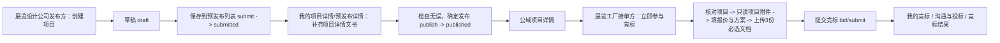
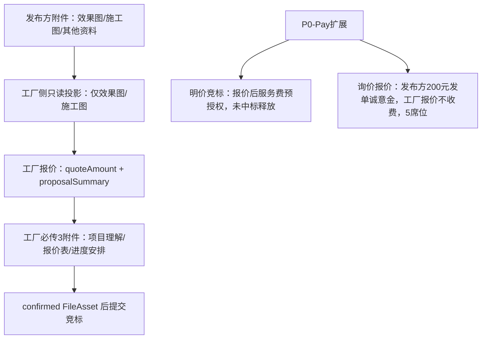

# 《Day2 发布方预发布闭环与工厂竞标报价闭环流程说明稿》

## 0. 总结论

Day2 说明稿主线固定为：

1. 发布方预发布闭环。
2. 工厂竞标报价闭环。

当前更稳的方案：

- 不把创建页做成交易总控台；创建页只负责基础信息、草稿、保存到预发布列表。

当前更省成本的方案：

- 复用现有 `submitted = 预发布列表`、`project_attachments`、`bid/submit` 和 BFF `/api/app/*`。

当前阶段最适合的方案：

- 先讲清页面职责、状态流、附件流、报价流和 P0-Pay 扩展位，不重开 BFF / Server。

风险更大的方案：

- 新增 `prepublish` 状态，把附件、报价、支付混成第二套状态机，或让创建页直接承担支付 / 报价 / 竞标结果职责。

## 1. Day2 主流程



## 2. 报价关系



## 3. 角色职责

展览设计公司发布方：

1. 创建项目。
2. 保存草稿。
3. 保存到预发布列表。
4. 补充项目详情文书。
5. 检查无误后正式发布。
6. 后续处理报价、沟通、结果、合同、履约。

展览工厂接单方：

1. 查看已发布项目。
2. 读取开放附件。
3. 提交报价与方案。
4. 上传竞标必选附件。
5. 进入我的竞标、沟通与投标、竞标结果。

## 4. 页面职责矩阵

| 页面 / 载体 | 当前职责 | 当前不得承担 |
|---|---|---|
| 创建 / 编辑页 | 基础信息、草稿保存、保存到预发布列表 | 最终发布确认、报价总控、P0-Pay 直接提交 |
| 我的项目 | 发布方私域入口，分 `我的发布 / 我的竞标` | 混用 owner 项目和 bidder 记录 |
| 预发布详情 | 附件文书区、返回草稿、作废归档、检查无误发布 | 新 `prepublish` 状态、支付真相、报价真相 |
| 附件区 | owner 在 `submitted-or-later` 可写 | 把 `objectKey` 当业务真相 |
| 公域项目详情 | 只读展示、发布方回我的项目、工厂进竞标 | owner 私有附件管理、交易总控 |
| 竞标提交页 | 核对项目、读只读附件、填报价方案、上传 3 份必选文档、提交竞标 | owner 附件写入、完整竞标工作台 |
| 我的竞标 | 工厂私域记录入口，进入沟通与投标或竞标结果 | compare board、loser board、post-award 工作台 |

## 5. 状态与动作

### 5.1 发布方项目状态

当前 canonical lifecycle 继续固定为：

1. `draft`
2. `submitted`
3. `published`
4. `bidding_closed`
5. `awarded`
6. `converted_to_order`
7. `archived`

用户侧命名继续固定为：

1. `draft` -> `草稿`
2. `submitted` -> `预发布列表`
3. `published` -> `竞标中`
4. `awarded / converted_to_order` -> `进行中`

### 5.2 发布方动作

`draft`：

1. `仅保存草稿` -> existing save。
2. `保存到预发布列表` -> existing submit。

`submitted`：

1. `检查无误，确定发布` -> existing publish。
2. `返回草稿继续编辑` -> existing withdraw。
3. `作废归档` -> existing archive。

`published`：

1. `查看详情`。
2. `补充资料`。
3. `下架关闭` -> existing close / archive boundary。

当前不得新增：

1. `prepublish`。
2. `prepublished`。
3. `saveToPrepublish`。
4. `confirmPublish`。

## 6. 附件流程

owner 附件流程：

1. owner 在 `submitted-or-later` 进入项目详情文书区。
2. 选择附件。
3. `init -> direct upload -> confirm`。
4. 得到 confirmed `FileAsset`。
5. bind 到 `project_attachments`。
6. `project_attachments` 成为项目附件业务真相。
7. `Evidence` 可继续作为后续流程证据真相，但不得替代 `project_attachments`。

附件类型：

1. `effect_image`。
2. `construction_doc`。
3. `other_material`。

工厂侧只读投影：

1. 只读 `effect_image`。
2. 只读 `construction_doc`。
3. 不读 `other_material`。
4. 不展示上传 / 删除。

## 7. 工厂竞标提交流程

工厂竞标提交页固定为三步：

1. 第一步：核对项目。
2. 第二步：填写报价与方案说明。
3. 第三步：上传必选文档。

提交字段继续复用既有 `POST /api/app/bid/submit` 最小字段：

1. `projectId`
2. `quoteAmount`
3. `proposalSummary`
4. `projectUnderstandingFileAssetId`
5. `quoteSheetFileAssetId`
6. `schedulePlanFileAssetId`

3 个附件字段必须引用 confirmed `FileAsset`：

1. `项目理解`
2. `报价表`
3. `进度安排`

当前禁止：

1. 使用 `objectKey` 作为 submit truth。
2. 使用未 confirm upload session。
3. 使用本地文件路径。
4. 把 submit success body 扩成完整 bid workspace。

## 8. P0-Pay 当前边界

截至 `2026-04-26`，Day2 只承认以下 P0-Pay 当前边界：

1. L0 母资料冻结：`2026-04-24`。
2. L2 contracts 冻结：`2026-04-26`。
3. L5 frontend consumption 文书标注：`2026-05-02`，晚于当前日期，当前待核对。
4. implementation unlock 文书标注：`2026-05-03`，晚于当前日期，当前不得作为实现放行依据。

因此 Day2 固定结论：

1. P0-Pay 不在创建页直接提交。
2. 创建页只保留未来扩展位，不展示支付执行。
3. 明价竞标服务费预授权发生在工厂报价之后，不发生在发布方创建基础项目时。
4. 询价报价单 200 元发单诚意金属于 P0-Pay 扩展位，不进入本轮普通创建接口。
5. 消息楼只可作为只读资金状态与沟通 handoff，不是支付执行台。

## 9. 当前最小闭环

Day2 当前最小闭环为：

1. 发布方创建项目。
2. 发布方保存草稿。
3. 发布方保存到预发布列表。
4. 发布方补充文书附件。
5. 发布方检查无误正式发布。
6. 工厂读取公域详情。
7. 工厂读取效果图 / 施工图只读投影。
8. 工厂填写报价与方案。
9. 工厂上传 3 份必选文档。
10. 工厂提交竞标。
11. 工厂在我的竞标 / 沟通与投标 / 竞标结果承接后续。

## 10. 需要保留但暂不开通

本轮保留但不开通：

1. `prepublish / prepublished` 新状态或新 path。
2. 通用钱包、余额、支付中心、结算、发票、履约保证金。
3. 泛私信、群聊、完整 compare board、loser board、完整 post-award 工作台。
4. `formal-info` full-page takeover。
5. `renovation / custom_furniture` 可见入口。
6. P0-Pay L5 Flutter implementation authority。

## 11. 后续扩展位

后续扩展位固定为：

1. P0-Pay 明价竞标服务费预授权。
2. P0-Pay 询价报价单 200 元发单诚意金。
3. P0-Pay 合同确认后平台服务费。
4. 消息楼资金状态只读展示。
5. 竞标摘要、项目沟通 handoff。
6. 订单、合同、履约、验收、评价、争议继续处理入口。

这些扩展位不得反向污染创建页。

## 12. 风险点与处理

### 12.1 创建页过载风险

风险：

- 创建页已经承载创建、编辑、附件说明、未来 P0-Pay 入口暗示，容易被误做成交易总控台。

处理：

- 创建页只保留基础信息与保存动作。
- 预发布详情承担发布确认。
- 竞标提交页承担工厂报价。
- P0-Pay 作为后续扩展位。

### 12.2 状态机漂移风险

风险：

- 把 `预发布列表` 写成 `prepublish` persisted state。

处理：

- `预发布列表` 只绑定 canonical `submitted`。
- 所有 action 继续复用 existing path。

### 12.3 附件泄露风险

风险：

- 工厂侧看到 `other_material` 或出现上传 / 删除动作。

处理：

- 工厂侧只读投影只允许 `effect_image / construction_doc`。
- owner 写侧仍留在 `我的项目详情 / 预发布详情`。

### 12.4 P0-Pay 时间真相风险

风险：

- P0-Pay L5 文书日期为 `2026-05-02`，晚于当前 `2026-04-26`。

处理：

- 本轮只引用已到当前日期的 L0 / L2。
- L5 作为待核对项，不作为 Day2 代码实现或联调依据。

## 13. 阶段门禁核查表

已通过门禁：

1. Day1 范围冻结单已冻结。
2. Day2 流程说明稿已冻结。
3. 未新增 contract path、schema、enum。
4. 未新增 lifecycle state。
5. 未要求本地 BFF / Server 可写可跑。
6. 未跳过 `FileAsset + project_attachments` 真相链。

未通过门禁：

1. P0-Pay L5 时间真相待核对。
2. P0-Pay implementation unlock 时间真相待核对。
3. 若后续要进入前端体验实现，仍需单独输出实现阶段门禁核查表。
4. 若后续要进入 BFF / Server，仍需确认云上 runtime、发布链路和对应 L3/L4 门禁。

一票否决门禁：

1. 任何新增 `prepublish` 状态或路径。
2. 任何普通创建接口改造。
3. 任何 Flutter 直连 Server。
4. 任何 BFF 业务真相或资金真相。
5. 任何把 P0-Pay 放进创建页直接提交的实现。

下一阶段结论：

- `Go`：基于本说明稿做人工评审、产品确认、后续前端实现门禁准备。
- `No-Go`：直接改 BFF / Server。
- `No-Go`：直接改普通创建接口。
- `No-Go`：直接进行 Computer Use 联调。

## 14. Formal Conclusion

Day2 正式冻结为：

```text
主线是发布方预发布闭环 + 工厂竞标报价闭环。
创建页不是交易总控台。
P0-Pay 不在创建页直接提交。
submitted 继续是预发布列表的唯一 canonical carrier。
project_attachments 继续是项目附件业务真相。
bid/submit 继续是当前工厂竞标提交命令。
```
