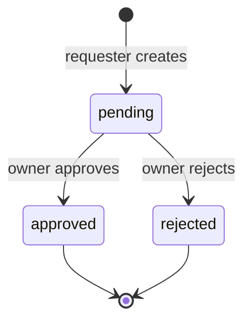

# 申请参与竞标 Phase 1 L3 Server Truth / Persistence 冻结单

## Pricing Override Note

自 `2026-04-29` 起，若项目已接入
[platform_pricing_backend_truth_master_v1.md](/Users/wangweiwei/Desktop/展览装修之家总控/docs/02_backend/platform_pricing_backend_truth_master_v1.md)
定义的收费主线，则本文件中关于 `approved -> 可直接提交竞标` 的旧真相只保留为历史最小闭环参考。

当前收费主线下：

1. `approved` 只代表竞标准入通过
2. `approved` 后是否可进入 `bid_submit`，必须继续读取 `BidSubmitPricingGate`
3. 若 `4000 元竞标服务费预授权额度` 未冻结，则当前 next action 必须先进入 `BidServiceFeeAuthorization`

## 0. 总裁决

- Server 是否为唯一申请状态真相：是
- 是否新增独立 `BidParticipationRequest` 真值：是
- 是否粗暴复用 `ProjectNameAccessRequest` 作为新真值：否
- 是否允许 BFF / Flutter 自行判断 approved：否

## 1. 状态机

## 2. 最小持久化

表：`bid_participation_requests`

| 字段 | 说明 |
|---|---|
| `id` | request id / thread id |
| `project_id` | 项目 |
| `requester_organization_id` | 申请方组织 |
| `requested_by_user_id` | 申请用户 |
| `requested_by_actor_id` | 申请 actor |
| `state` | `pending / approved / rejected` |
| `reviewed_by_user_id` | 审批用户 |
| `reviewed_by_actor_id` | 审批 actor |
| `reviewed_at` | 审批时间 |
| `created_at / updated_at` | 时间戳 |

唯一约束：

- 同一 `project_id + requester_organization_id` 只能存在一个 `pending`；
- 已有 `approved` 时不允许重复申请；
- `rejected` 后允许再次申请，作为新记录。

## 3. 准入规则

| 链路 | 规则 |
|---|---|
| 创建申请 | 项目必须 published；申请方必须具备竞标资格；不能是项目 owner |
| 审批 | 只能项目发布方组织审批；只能处理 pending |
| 名称展示 | owner 或 approved participation 可见真实名称 |
| 报价依据资料列表 | 必须 approved participation |
| 报价依据资料文件访问 | 必须 approved participation |
| 竞标提交 | 历史最小闭环下必须 approved participation；当前收费主线下还必须同时满足 `4000 frozen` |
| 项目沟通 | pending/approved/rejected 均可进入受控项目沟通承接 |

## 4. 兼容策略

- 历史 `project_name_access_requests` 的 approved 可继续解锁名称展示；
- 新申请不再写入 `project_name_access_requests`；
- 消息楼新增 `bid_participation_request` 卡片，不删除旧卡片类型，避免历史消息断链。

## 5. 审计

| action | 说明 |
|---|---|
| `BidParticipationRequested` | 创建申请 |
| `BidParticipationApproved` | 通过 |
| `BidParticipationRejected` | 拒绝 |

## 6. 不做项

- 历史最小闭环下不自动扣钱；
- 当前收费主线下不自动扣钱，但允许把 `approved` 后 first next action 改写为 `4000` 冻结 gate；
- 不新增 NDA；
- 不做资料水印；
- 不做后台批量审批。

## 7. 阶段门禁

| 门禁 | 结论 |
|---|---|
| Server Truth | Pass |
| Persistence/migration | Allow |
| Server implementation | Allow |
