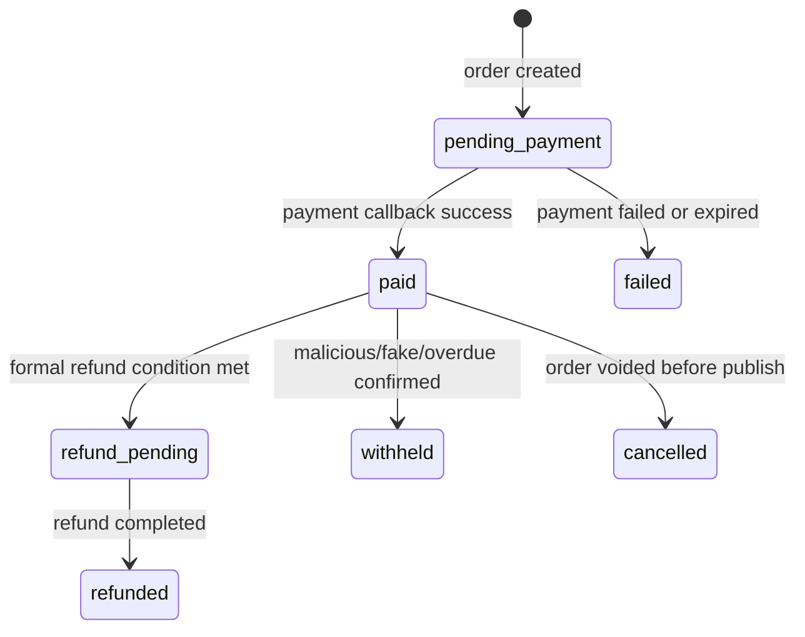
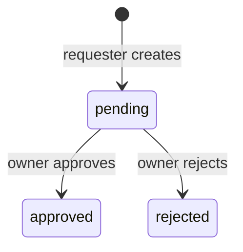
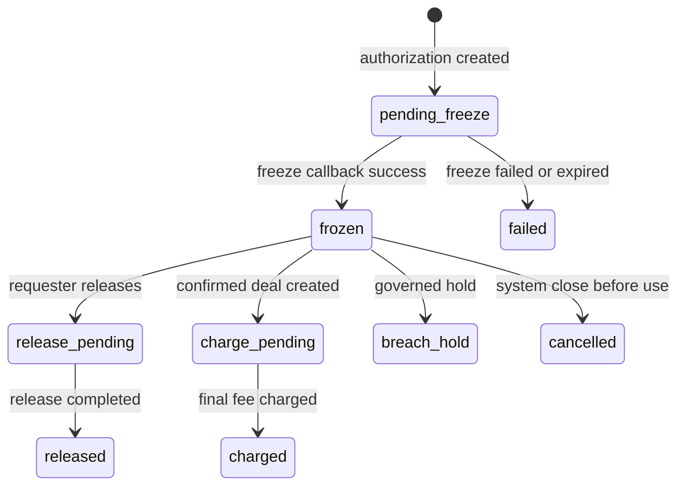
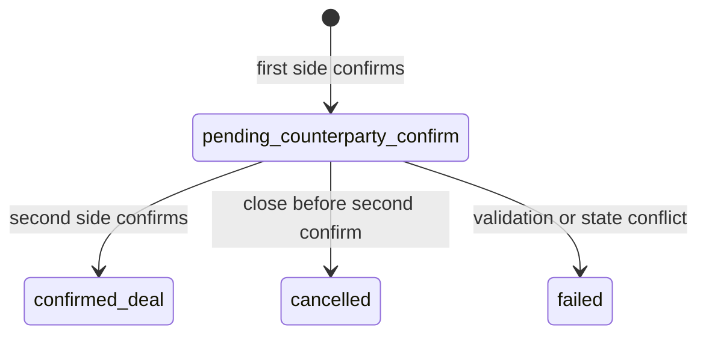

# 《平台收费规则 L3 backend truth 母文件 V1》

## 0. 总裁决

当前收费 `L3 backend truth` 正式重写完成。

本轮正式选择：

1. `Server` 仍是唯一收费真相 owner
2. 收费真相直接挂到既有 `project publish -> bid participation request -> bid submit` 主链
3. 收费专属真相只新增最小聚合根，不另起一套平行发布体系
4. 旧 `P0-Pay trade-task / inquiry deposit / 3% dynamic authorization` 后端真相不再作为当前收费 L3 authority

当前更稳的方案：

- 复用现有 `project / bid_participation_request / bid` 主链，只把 `200 / 4000 / 成交确认 / 扣费` 作为收费专属聚合根接入

当前更省成本的方案：

- 复用现有 `payment order / payment transaction / callback / idempotency / audit` 基础设施，不重造第二套支付骨架

当前阶段最适合的方案：

- 先冻结 `项目真实性诚意金`、`竞标服务费预授权额度`、`deal confirmation`、`service fee charge` 的 L3 真相，不直接开 runtime

风险更大的方案：

- 一边保留旧 `P0-Pay 3% + 报价金额动态预授权`，一边在局部代码里偷改 `200 / 4000 / 阶梯费率 / 会员折扣`

本文件生效后：

1. [exhibition_trade_task_p0_pay_server_truth_addendum_v1_3.md](/Users/wangweiwei/Desktop/展览装修之家总控/docs/02_backend/exhibition_trade_task_p0_pay_server_truth_addendum_v1_3.md) 不再作为当前收费 backend truth 主文件
2. [exhibition_trade_task_membership_service_fee_linkage_server_truth_addendum_v1.md](/Users/wangweiwei/Desktop/展览装修之家总控/docs/02_backend/exhibition_trade_task_membership_service_fee_linkage_server_truth_addendum_v1.md) 不再作为当前费率 / 折扣 backend truth 主文件
3. 当前收费 L3 只以本文件为准

## 1. Scope

本文件只冻结 `当前平台收费规则` 的 `L3 Server truth`。

本文件覆盖：

1. `project/publish` 前的 `200 元项目真实性诚意金` 真相
2. `bid participation approved -> bid submit` 之间的 `4000 元竞标服务费预授权额度` 真相
3. `deal confirmation` 的双向确认与成交成立真相
4. 成交后平台服务费的计算、扣取与剩余额度释放真相
5. 会员折扣在当前收费主线中的读取、快照与金额归属
6. `payment order / transaction / callback / audit` 的收费专属归属
7. `pricing summary` 等只读派生边界

本文件不覆盖：

1. migration 文件
2. 最终表结构字段实现细节
3. BFF surface freeze
4. Flutter consumption freeze
5. `apps/server/**` 实现改动
6. 钱包 / 余额 / 金币 / 资金池
7. 通用 payment / billing center
8. 清分结算 / 发票 / 财务后台
9. 履约保证金
10. 会员直购支付 runtime

## 2. Backend Truth Conclusion

当前正式冻结：

1. `Server` 是当前收费主线唯一业务真相 owner
2. `Server` 是当前收费主线唯一金额真相 owner
3. `Server` 是当前收费主线唯一支付回调 owner
4. `Server` 是当前收费主线唯一审计 owner

以下对象不是 truth owner：

1. Flutter
2. BFF
3. Admin
4. message interaction / counterpart conversation
5. `profile/payment-and-billing-status/*`
6. `profile/membership/*`
7. Flutter local cache
8. BFF read projection

## 3. Relation To Earlier Truth

本文件对旧后端真相的关系正式冻结如下：

1. 旧 `P0-Pay` 后端真相只保留为历史迁移参考
2. 旧 `会员费率联动 = feeRate 2.5% / 2.0% / 1.5%` 只保留为历史方案参考
3. `payment_billing_v1_backend_truth_addendum.md` 继续只保留为 profile 只读状态 family，不取得当前收费执行真相 owner 地位
4. `membership_entitlement_v1_backend_truth_addendum.md` 继续只保留为 membership read truth provider，不取得当前收费执行主线 owner 地位

本文件只在以下新对象内有界覆盖旧口径：

1. `ProjectAuthenticitySincerityOrder`
2. `BidServiceFeeAuthorization`
3. `DealConfirmation`
4. `PlatformServiceFeeCharge`
5. 上述对象相关的 `PaymentOrder / PaymentTransaction / PaymentCallbackEvent / PricingAuditEvent`

## 4. Module Ownership Freeze

当前 backend 模块归属正式冻结为：

| 模块/家族 | 当前角色 | 冻结结论 |
|---|---|---|
| `project` | 项目发布主锚点 | 继续持有 `draft -> submitted -> published` lifecycle truth，但 `publish` 必须受 `200` gate 约束 |
| `bid_participation_request` | 竞标准入真相 | 继续持有 `pending / approved / rejected`，但 `approved` 不再自动等于可直接 `bid/submit` |
| `bid` | 竞标提交真相 | 继续持有 `bid/submit`，但必须读取 `approved + 4000 frozen` 双门禁 |
| `platform_pricing` | 当前收费专属真相 owner | 新收费主线的唯一业务聚合 owner；实现阶段可复用 `p0_pay` 现有基础设施 |
| `membership` | 会员等级只读 provider | 只提供 bidder organization 的当前有效 paid membership tier，不持有收费状态机 |
| `payment_billing` | profile 只读家族 | 不是当前收费执行真相 owner |

实现期可复用但不等于继续承认其旧业务语义的基础设施：

1. `PaymentOrderEntity`
2. `PaymentTransactionEntity`
3. payment callback 验签与幂等
4. idempotency services
5. audit services

## 5. Server-owned Aggregate Roots

当前收费主线最小聚合根冻结为：

| Aggregate | Server-owned truth | 说明 |
|---|---|---|
| `Project` | 发布主体、项目生命周期、owner 权限 | 收费主线仍以当前 project 为业务锚点 |
| `ProjectAuthenticitySincerityOrder` | `200 元项目真实性诚意金` 订单、支付、退回、扣留 | publish gate 的资金前置条件 |
| `BidParticipationRequest` | 参与竞标审批状态 | 只承接准入，不再直接放行 bid submit |
| `BidServiceFeeAuthorization` | `4000 元竞标服务费预授权额度` 冻结、释放、扣费占用 | bid submit 的资金前置条件 |
| `Bid` | 竞标提交、报价与方案 | 竞标业务锚点 |
| `DealConfirmation` | 唯一合作对象锁定、合同文件、金额双确认、成交状态 | 当前唯一正式成交成立锚点 |
| `PlatformServiceFeeCharge` | base fee、membership 折扣、final fee、charge 状态 | 仅在 `confirmed_deal` 后成立 |
| `PaymentOrder` | 订单级支付 / 冻结 / 退款 / 释放真相 | 资金动作共用订单锚点 |
| `PaymentTransaction` | 支付通道交易真相 | 发起、查询、回调引用 |
| `PaymentCallbackEvent` | 回调接收、验签、幂等处理真相 | Server 唯一回调入口 |
| `PricingAuditEvent` | 业务与资金状态审计真相 | 可落到统一 `audit_logs` |

## 6. Derived Gates And Summary Truth

当前收费主线正式承认两个 `Server-derived gate`：

1. `ProjectPublishPricingGate`
2. `BidSubmitPricingGate`

这两个 gate 的正式含义是：

1. 它们是 `Server-derived business gate`
2. 它们不是 BFF / Flutter 本地状态机
3. 它们不是新的独立持久化主聚合
4. 它们只由 Server 根据 canonical truth 派生

### 6.1 `ProjectPublishPricingGate`

最小派生输入：

- `project.state`
- `ProjectAuthenticitySincerityOrder.orderStatus`
- `project.organizationId`

最小派生结论：

- `publishGateStatus`
- `authenticitySincerityRequired`
- `authenticitySincerityStatus`
- `nextAction`

### 6.2 `BidSubmitPricingGate`

最小派生输入：

- `BidParticipationRequest.state`
- `BidServiceFeeAuthorization.authorizationStatus`
- `projectId + bidderOrganizationId`

最小派生结论：

- `bidSubmissionEligible`
- `authorizationRequired`
- `authorizationStatus`
- `nextAction`

## 7. Project Authenticity Sincerity Truth

`ProjectAuthenticitySincerityOrder` 最小真相语义：

- `orderId`
- `projectId`
- `publisherOrganizationId`
- `amount`
- `currency`
- `paymentOrderId`
- `orderStatus`
- `paidAt`
- `refundRequestedAt`
- `refundedAt`
- `withheldAt`
- `withholdReasonCode`
- `ruleVersion`
- `ruleSnapshotHash`

Server truth rules：

1. 金额固定为 `200.00`
2. 名称必须是 `项目真实性诚意金`
3. 不得在 Server truth、错误码、状态文本中写成押金、罚款、履约保证金或平台服务费
4. 订单 owner 只能是当前 `project.organizationId`
5. `project/publish` 前若要求收费，必须先满足 `orderStatus = paid`
6. 项目成交成立或合规正式撤回后，应进入退款流程
7. 恶意发布、虚假项目、长期不处理结果时，可进入 `withheld`

最小状态机：

## 8. Project Publish Truth Override

当前 `project` 模块仍持有 publish lifecycle truth。

但 `publishProject` 的收费 override 正式写死如下：

1. `submitted -> published` 不再是裸状态流
2. 若当前项目命中收费主线，则 `publishProject` 必须读取 `ProjectPublishPricingGate`
3. 当 `ProjectAuthenticitySincerityOrder.orderStatus != paid` 时，`publishProject` 必须 fail closed
4. `publishProject` 不得隐式创建收费订单
5. `publishProject` 不得隐式代扣或吞掉 `200`

## 9. Bid Participation Truth Override

当前 `BidParticipationRequest` 最小真相语义继续保持：

- `id`
- `projectId`
- `requesterOrganizationId`
- `requestedByUserId`
- `requestedByActorId`
- `state`
- `reviewedByUserId`
- `reviewedByActorId`
- `reviewedAt`

状态机继续保持：

但收费 override 正式写死如下：

1. `approved` 只代表竞标准入通过
2. `approved` 不再自动等于可直接 `bid/submit`
3. `approved` 后 first next action 必须由 `BidSubmitPricingGate` 决定
4. 若 `4000` 未冻结，则 next action 必须先进入 `BidServiceFeeAuthorization`

## 10. Bid Service-fee Authorization Truth

`BidServiceFeeAuthorization` 最小真相语义：

- `authorizationId`
- `projectId`
- `bidParticipationRequestId`
- `bidderOrganizationId`
- `publisherOrganizationId`
- `authorizationQuotaAmount`
- `currency`
- `paymentOrderId`
- `authorizationStatus`
- `chargedAmountUsed`
- `releasedAmount`
- `paymentChannel`
- `frozenAt`
- `releasedAt`
- `chargedAt`
- `ruleVersion`
- `ruleSnapshotHash`

Server truth rules：

1. 金额固定为 `4000.00`
2. 名称必须是 `竞标服务费预授权额度`
3. 不得写成报名费、竞标费、席位费、履约保证金、货款或平台服务费本身
4. `projectId + bidderOrganizationId` 同时只允许一个活跃授权对象
5. 创建授权前必须已有 `approved` 的 `BidParticipationRequest`
6. `authorizationStatus = frozen` 才允许 `bid/submit`
7. 主动 release 成功即视为主动放弃本次竞标
8. 主动 release 后不得再视为当前项目下的 `bidSubmissionEligible`
9. `BidServiceFeeAuthorization` 是 quota truth，不是 final fee truth

最小状态机：

## 11. Bid Submit Truth Override

当前 `bid` 模块仍持有 `bid/submit` 真相。

但收费 override 正式写死如下：

1. `BidWriteService` 在既有 `approved participation` 校验之前或之后，都必须同时校验 `BidSubmitPricingGate`
2. 缺少 `approved` 或缺少 `frozen 4000` 任一条件，都必须 fail closed
3. `bid/submit` 不得自行写入最终收费真相
4. `bid/submit` success 不得等于冻结成功

## 12. Deal Confirmation Truth

`DealConfirmation` 最小真相语义：

- `dealConfirmationId`
- `projectId`
- `selectedBidId`
- `publisherOrganizationId`
- `factoryOrganizationId`
- `finalConfirmedAmount`
- `currency`
- `contractFileAssetIds`
- `publisherConfirmedAt`
- `factoryConfirmedAt`
- `dealStatus`
- `platformServiceFeeChargeId`
- `requestId`
- `traceId`

最小状态机：

Server truth rules：

1. `confirmed_deal` 是当前唯一正式成交成立状态
2. `selectedBidId + contractFileAssetIds + finalConfirmedAmount + 双向确认` 缺一不可
3. generic `contract/confirm` 不是当前收费主线的 charge trigger truth owner
4. 当前收费主线的成交确认必须由收费专属 `DealConfirmation` 真相持有

## 13. Service Fee Calculation Truth

当前正式收费算法必须由 Server 唯一持有。

推荐冻结为独立策略对象：

- `PlatformPricingServiceFeePolicy`

### 13.1 Base fee truth

`baseFeeAmount` 只能按 `finalConfirmedAmount` 计算：

1. `1 万元以下：固定 200 元`
2. `1 万元至 3 万元：超出 1 万元部分按 2%`
3. `3 万元至 10 万元：超出 3 万元部分按 1.5%`
4. `10 万元以上：超出 10 万元部分按 1%`
5. `base fee cap = 4000`

### 13.2 Membership discount truth

折扣只作用于 `baseFeeAmount`，不作用于 `200` 或 `4000`。

当前正式支持的 membership discount mapping：

| membership tier snapshot | discountRate | capAmount | 说明 |
|---|---:|---:|---|
| `none` | `1.0` | `4000` | 无会员折扣 |
| `free_certified` | `1.0` | `4000` | 免费认证不折扣 |
| `standard` | `0.9` | `3600` | 标准会员 9 折 |
| `professional` | `0.8` | `3200` | 专业会员 8 折 |

当前不在本文件中正式启用：

1. `ka`
2. `flagship`
3. 活动费率
4. 城市 / 行业差异费率

### 13.3 Membership snapshot timing

当前收费主线下，会员折扣 snapshot timing 正式冻结为：

1. 读取时点：`DealConfirmation` 从 `pending_counterparty_confirm -> confirmed_deal` 的成立时点
2. 读取对象：`selectedBidId` 对应 `bidderOrganizationId` 的当前有效 paid membership tier
3. 该 snapshot 一旦进入 `PlatformServiceFeeCharge`，后续不得被 BFF/Flutter 改写

这与旧 `P0-Pay` 的 `authorization create 时锁定 feeRate` 不同。

原因：

1. `4000` 是 quota，不是 final fee truth
2. 当前 final fee 只在成交成立后才正式生成

### 13.4 Final fee truth

`finalFeeAmount` 计算规则：

1. `baseFeeAmount = ladder(finalConfirmedAmount)`
2. `discountedFeeAmount = round(baseFeeAmount * membershipDiscountRate, 2)`
3. `finalFeeAmount = min(discountedFeeAmount, memberCapAmount)`

## 14. Platform Service Fee Charge Truth

`PlatformServiceFeeCharge` 最小真相语义：

- `chargeId`
- `projectId`
- `dealConfirmationId`
- `authorizationId`
- `bidderOrganizationId`
- `finalConfirmedAmount`
- `baseFeeAmount`
- `membershipTierSnapshot`
- `membershipDiscountRate`
- `capAmount`
- `finalFeeAmount`
- `chargeStatus`
- `chargedAt`
- `releasedRemainderAmount`
- `requestId`
- `traceId`

Server truth rules：

1. 只允许在 `DealConfirmation.dealStatus = confirmed_deal` 后创建
2. 扣费来源只能是已冻结的 `BidServiceFeeAuthorization`
3. `finalFeeAmount` 不得超过 `4000`
4. 剩余额度必须进入释放流程
5. 成交成立后，`ProjectAuthenticitySincerityOrder` 应进入退款流程

## 15. Payment Order / Transaction / Callback Truth

当前收费主线仍复用统一支付基础设施。

`PaymentOrder` 最小业务类型建议冻结为：

1. `project_authenticity_sincerity_payment`
2. `bid_service_fee_authorization_freeze`
3. `bid_service_fee_authorization_release`
4. `platform_service_fee_charge`
5. `project_authenticity_sincerity_refund`

冻结规则：

1. 通道动作仍是订单级支付 / 订单级冻结 / 订单级退款 / 订单级释放
2. callback 真相仍只允许由 Server 接收、验签、幂等、推进状态
3. BFF / Flutter 不得把客户端支付成功回显当成最终真相

## 16. Permission Truth

当前收费主线最小权限规则冻结如下：

1. 只有项目 owner 组织可以创建 / 支付 / 查看 `200` 订单
2. 只有 `approved` 的竞标方组织可以创建 / 冻结 / 释放 `4000` 授权对象
3. 只有 `selectedBidId` 对应的发布方与工厂方能推进 `DealConfirmation`
4. 只有收费 owner 对象可触发 charge / refund / release 状态推进

## 17. Derived Consumers Boundary

以下只允许作为派生消费者：

1. `exhibition_workbench`
2. `my_project`
3. `message_interaction / counterpart_conversation`
4. `profile/payment-and-billing-status/*`
5. BFF read projection
6. Flutter local cache

它们只能消费：

1. `pricing summary`
2. `nextAction`
3. `statusTextKey / reasonCode`

它们不得：

1. 计算 final fee
2. 计算 membership 折扣
3. 自行判断 `publish` 或 `bid_submit` 是否可放行

## 18. Retained No-Go

当前继续明确 `No-Go`：

1. 钱包 / 余额 / 金币 / 资金池
2. 通用 payment / billing center
3. settlement / clearing
4. invoice / tax / finance-admin
5. 履约保证金
6. membership direct purchase runtime
7. 云端直接开闸
8. 未经下游文书冻结直接改实现

## 19. Stage Conclusion

当前正式结论：

- `Go` for `L4 BFF surface authoring`
- `Go` for `L5 Flutter consumption authoring`
- `No-Go` for direct implementation
- `No-Go` for cloud write
- `No-Go` for runtime enablement

当前唯一下一轮动作：

- 编写新的收费 `L4 BFF surface`
