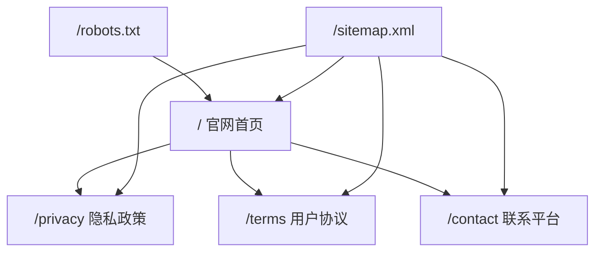
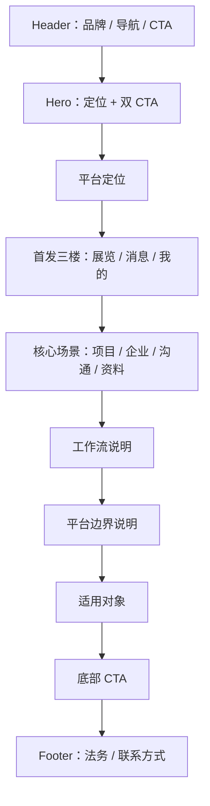
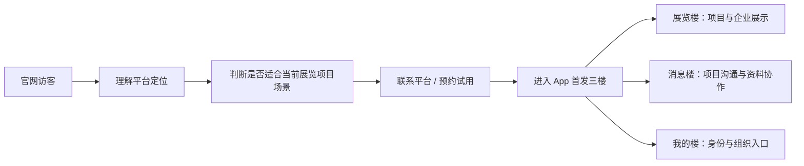

# 官方网站 Stage 2 Blueprint

## 0. 总裁决

`Stage 2 = PASS`。

基于 `docs/official-website-discovery.md`，第一版官网只做一个清晰、轻量、可构建、可部署预备的 landing page。官网公开表达聚焦展览项目展示、企业展示、项目沟通、资料协作、消息楼、我的楼，以及首发三楼：展览、消息、我的。

本蓝图未发现 P0/P1 边界风险，允许进入 Stage 3 独立 `apps/website` 实现。

## 1. 官网总定位

官网定位：

> 展览装修之家 / 展览定制之家，是面向展览装修与展览定制场景的项目展示、企业展示、项目沟通与资料协作平台。

对外表达必须保持克制，不宣传全交易闭环、支付收款、履约验收、智能派单或隐藏楼公开开放。

## 2. 首发目标用户

| 用户 | 关注点 | 官网回答 |
| --- | --- | --- |
| 项目发布方 | 找承接方、看资料、推进沟通 | 项目展示、企业展示、资料确认、消息楼 |
| 承接方 / 竞标方 | 发现项目、提交资料、沟通协作 | 项目展示、项目沟通、资料协作 |
| 企业展示主体 | 展示公司、工厂、供应商能力 | 企业展示与资料工作台分离 |
| 平台运营 / 合作方 | 理解平台边界和当前首发范围 | 首发三楼、边界说明、联系 CTA |

## 3. 当前最小闭环

1. 首页首屏讲清平台定位。
2. 说明首发三楼：展览、消息、我的。
3. 展示四个核心场景：项目展示、企业展示、项目沟通、资料协作。
4. 解释消息楼和我的楼的边界。
5. 提供预约试用、联系平台、查看协议与隐私的 CTA。
6. 全站不触发业务写操作，不接入登录，不接入支付，不接入生产项目动态数据。

## 4. 需要保留但暂不开通

- 装修楼公开入口。
- 全屋定制楼公开入口。
- 建材市场。
- 支付、扣费、钱包、保证金、结算、退款、发票。
- 完整合同签约与履约验收对外承诺。
- AI 推荐、智能派单、地图找厂、直播。
- CMS、博客系统、复杂后台、复杂动画。

## 5. 后续扩展位

| 扩展位 | 当前状态 | 后续前置 |
| --- | --- | --- |
| 官网下载页 | 预留 | App 分发口径、应用包和二维码冻结 |
| 真实案例页 | 预留 | 公开授权案例和脱敏素材冻结 |
| 企业入驻说明页 | 预留 | 入驻规则、审核 SLA 和资料字段冻结 |
| 帮助中心 | 预留 | 内容维护责任和 CMS 替代方案冻结 |
| Stage 5 云端部署 | 预留 | Nginx diff plan、端口、进程、smoke、回滚确认 |

## 6. 首页信息架构

1. Header：品牌、导航、CTA。
2. Hero：定位、边界内价值、双 CTA。
3. 平台定位区：为什么是展览装修/展览定制场景。
4. 首发三楼区：展览、消息、我的。
5. 核心场景区：项目展示、企业展示、项目沟通、资料协作。
6. 工作流说明区：从项目发现到资料协作的轻量路径。
7. 平台边界说明区：当前不开通和不承诺事项。
8. 适用对象区：发布方、承接方、展示企业、平台合作方。
9. CTA 区：预约试用 / 联系平台。
10. Footer：法务入口、联系方式、版权。

## 7. Sitemap

| Route | Purpose | Stage 3 |
| --- | --- | --- |
| `/` | 官网 landing page | 实现 |
| `/privacy` | 隐私政策摘要与正式源说明 | 实现 |
| `/terms` | 用户协议摘要与正式源说明 | 实现 |
| `/contact` | 联系平台 | 实现 |
| `/robots.txt` | 搜索引擎规则 | 实现 |
| `/sitemap.xml` | Sitemap | 实现 |

不开放 `/blog`、`/pricing`、`/case-studies`、`/admin`、`/renovation`、`/custom-furniture`、`/marketplace`、`/payment`。

## 8. 首页区块顺序

| 区块 | 标题 | 说明 | CTA | 展示重点 |
| --- | --- | --- | --- | --- |
| Hero | 展览装修与展览定制的项目协作入口 | 用项目、企业、资料和沟通组织首发体验 | 预约试用 / 查看能力边界 | 平台定位、首发三楼、非全交易承诺 |
| 平台定位 | 先把展示和协作链路做清楚 | 展览项目和企业资料需要有序承接 | 了解首发范围 | 展示、沟通、资料确认 |
| 首发三楼 | 展览、消息、我的 | 只公开首发三楼 | 查看三楼能力 | 不公开装修/定制隐藏楼 |
| 核心场景 | 项目展示、企业展示、项目沟通、资料协作 | 解释当前可说能力 | 联系平台 | 四个能力卡 |
| 工作流 | 从项目发现到资料确认 | 轻量展示用户路径 | 预约试用 | 不说成交、支付、履约闭环 |
| 边界 | 当前不承诺什么 | 保护平台真相 | 查看说明 | 支付、全交易、AI、地图、直播等不开通 |
| 适用对象 | 为四类用户建立入口 | 发布方、承接方、展示企业、合作方 | 联系平台 | 使用场景 |
| CTA | 从官网进入下一步沟通 | 留联系入口和法务入口 | 联系平台 | 转化路径 |

## 9. 可公开表达能力

- 面向展览装修与展览定制场景。
- 支持项目展示。
- 支持企业展示。
- 支持项目沟通。
- 支持资料协作 / 资料确认。
- 支持消息与互动入口。
- 支持我的楼聚合个人、组织、认证、项目等入口。
- 当前首发围绕展览、消息、我的三楼展开。

## 10. 禁止外推承诺

- 已实现完整交易闭环。
- 已实现支付收款、扣费、结算、退款、钱包、保证金、发票。
- 已实现合同签约、履约验收全流程。
- 已实现智能派单、AI 推荐、地图找厂、直播。
- 装修楼、全屋定制楼、建材市场已经公开开放。
- 已有大量真实客户案例。
- 生产环境全链路稳定运行。

## 11. SEO 关键词建议

- 展览装修
- 展览定制
- 展台搭建
- 展览项目管理
- 展览企业展示
- 展会装修平台
- 展览项目沟通
- 展览资料协作

SEO 不做关键词堆砌，title 和 description 必须自然表达平台定位。

## 12. 官网文案总调性

- 克制。
- 专业。
- 平台型。
- 事实优先。
- 少营销形容词，多说明边界和场景。
- 不使用“颠覆”“革命性”“全网第一”“保证成交”“一站式全闭环”等无真源词。

## 13. Mermaid Sitemap 图

## 14. Mermaid 首页区块结构图

## 15. Mermaid 官网到 App 转化路径图

## 16. 四类判断

| 判断项 | 结论 |
| --- | --- |
| 哪个更稳 | 新增独立 `apps/website`，隔离官网与 App / Admin / BFF / Server |
| 哪个更省成本 | 复用仓库已有 Next.js / React / TypeScript 技术经验 |
| 哪个更适合当前阶段 | 单页官网 MVP，加 `/privacy`、`/terms`、`/contact` 轻页面 |
| 哪个风险更大 | 直接改 Admin / Flutter / BFF / Server，或直接改云端 Nginx |

## 17. Stage 3 Go / No-Go

`Go for Stage 3`：

- Discovery 存在。
- 技术栈可支撑独立官网。
- 不需要修改 Admin / Flutter / BFF / Server。
- 不需要 CMS、支付、账号、数据库或云端部署改造。
- 当前脏改不与 `apps/website`、官网 docs、workspace 脚本冲突。

`No-Go` 保留：

- 若实现必须触碰禁止范围，立即停止。
